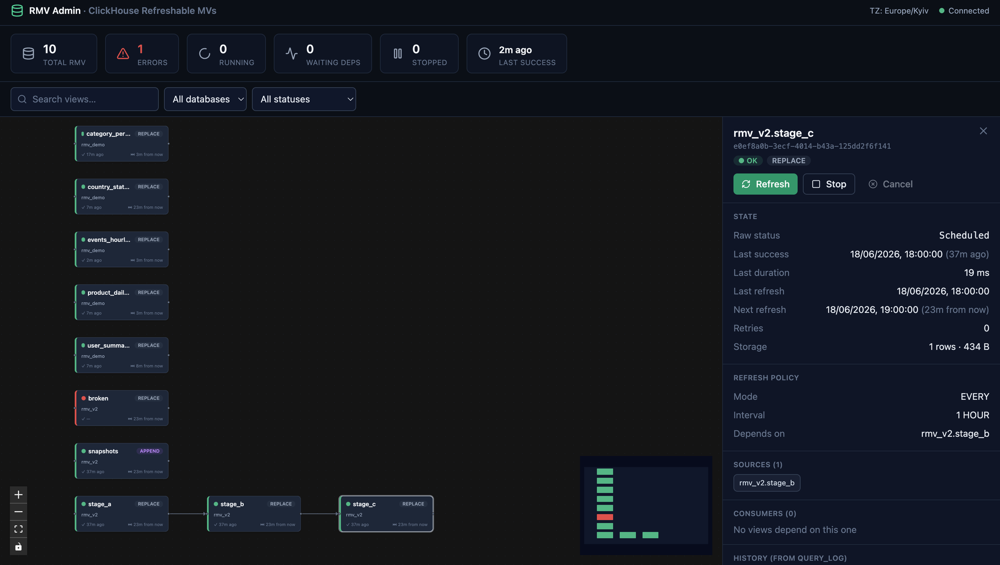

# RMV Admin — ClickHouse Refreshable Materialized Views

A small web tool to **visualize, monitor and control** [Refreshable Materialized Views](https://clickhouse.com/docs/materialized-view/refreshable-materialized-view) (RMV) in ClickHouse.

- 📊 **Dependency graph** of all RMVs (`DEPENDS ON` edges) with automatic layout
- 🟢 **Live status** for every refresh state — `Scheduled`, `Running`, `RunningOnAnotherReplica`, `WaitingForDependencies`, `MissingDependencies`, `Disabled` — plus a red **error** state derived from the last refresh's exception
- 🏷️ **REPLACE / APPEND** mode badge per view
- 🎛️ **Actions**: Refresh (with optional `WAIT`), Stop, Start, Cancel, and a tool-side **cascade** refresh in topological order
- 🧾 **Refresh history** reconstructed from `system.query_log`
- 📈 **Dashboard** aggregates (errors, running, waiting on deps, …)

Targets a modern ClickHouse and was validated live against **26.2** and **26.5**.



---

## Architecture

```
Browser ──HTTP──> nginx (frontend, :3000) ──/api──> FastAPI (backend, :8000) ──> ClickHouse
```

The browser never talks to ClickHouse directly — all access goes through the backend, which connects with a service user that needs only read access to a few `system` tables plus the `SYSTEM VIEWS` grant.

**Stack:** FastAPI + `clickhouse-connect` · React 19 + Vite + `@xyflow/react` (React Flow) + `@dagrejs/dagre` + TanStack Query + Zustand + Tailwind CSS.

### Project structure

```
backend/                FastAPI service
  config.py             settings (env vars)
  clickhouse_client.py  ClickHouse access, DDL parsing, status/history/actions
  main.py               REST API
frontend/               React + Vite SPA
  src/api/              fetch client + TanStack Query hooks
  src/components/       graph (xyflow), dashboard, details panel, ui kit
  src/lib/              status/time formatting, helpers
docker/clickhouse/init/ demo RMVs (DEPENDS ON chain, APPEND, failing view)
docker-compose.yml      clickhouse + backend + frontend
SPEC_v2_REVIEW.md       technical analysis of ClickHouse RMV behaviour
```

---

## Quick start

```bash
docker compose up -d --build
# UI:      http://localhost:3000
# API:     http://localhost:8000/api
```

The bundled `clickhouse` service ships demo RMVs (`docker/clickhouse/init/`) so the graph isn't empty on first run: a `DEPENDS ON` chain, an `APPEND` view, and a deliberately failing view.

To point at your **own** ClickHouse instead, edit the `backend` environment in `docker-compose.yml` (see below) and remove/disable the bundled `clickhouse` service.

---

## Configuration

Backend settings (env vars / `backend/.env`, see `backend/.env.example`):

| Variable | Default | Description |
|---|---|---|
| `CLICKHOUSE_HOST` | `localhost` | ClickHouse host |
| `CLICKHOUSE_PORT` | `8123` | HTTP port (use `8443` for Cloud) |
| `CLICKHOUSE_USER` / `CLICKHOUSE_PASSWORD` | `default` / — | Service user credentials |
| `CLICKHOUSE_DATABASE` | `default` | Default database |
| `CLICKHOUSE_SECURE` | `false` | `true` for HTTPS (ClickHouse Cloud) |
| `DEFAULT_DATABASES` | _(all)_ | Comma-separated allowlist of databases to show |
| `POLL_INTERVAL_SECONDS` | `15` | UI auto-refresh interval |
| `QUERY_LOG_CLUSTER` | _(none)_ | Cluster name for `clusterAllReplicas()` when reading `query_log` |
| `DISPLAY_TIMEZONE` | `UTC` | IANA timezone for rendering timestamps |

### ClickHouse Cloud

```yaml
- CLICKHOUSE_HOST=<service>.clickhouse.cloud
- CLICKHOUSE_PORT=8443
- CLICKHOUSE_SECURE=true
- QUERY_LOG_CLUSTER=default   # Cloud is multi-node — needed for complete refresh history
```

### Service-user grants

```sql
CREATE USER rmv_ui_svc IDENTIFIED BY '…';
GRANT SELECT ON system.tables        TO rmv_ui_svc;
GRANT SELECT ON system.view_refreshes TO rmv_ui_svc;
GRANT SELECT ON system.query_log     TO rmv_ui_svc;   -- for history
GRANT SYSTEM VIEWS ON <db>.*          TO rmv_ui_svc;   -- refresh/stop/start/cancel/wait
```

---

## API

| Method | Path | Description |
|---|---|---|
| `GET` | `/api/views` | All RMVs with current state |
| `GET` | `/api/views/{db}/{name}` | View details (schedule, sources, consumers, DDL) |
| `GET` | `/api/views/{db}/{name}/history?limit=N` | Refresh history from `query_log` |
| `GET` | `/api/graph` | Nodes + `DEPENDS ON` edges |
| `GET` | `/api/status` | Dashboard aggregates |
| `POST` | `/api/views/{db}/{name}/refresh` | `{cascade, wait}` |
| `POST` | `/api/views/{db}/{name}/{stop,start,cancel}` | Schedule control |

---

## Notes & gotchas (ClickHouse RMV)

- `system.view_refreshes` holds **one row per view** (current state) — history comes from `system.query_log` (tagged `log_comment = 'refresh of <db>.<view>'`, available since 25.4).
- A **failed** refresh shows `status = 'Scheduled'` with a non-empty `exception` — there is no `Failed` status; error is derived from `exception`.
- **APPEND** views accumulate rows on every refresh; the UI warns before a manual refresh.
- ClickHouse does **not** cascade `SYSTEM REFRESH` to dependents — the cascade button does it client-side in topological order.
- `DEPENDS ON` is parsed from the DDL (`create_table_query`); `system.tables.dependencies_*` do **not** expose it.

A detailed technical analysis lives in [`SPEC_v2_REVIEW.md`](SPEC_v2_REVIEW.md).

---

## Troubleshooting

```bash
curl http://localhost:8000/api/health      # backend + ClickHouse status
docker compose logs -f backend             # backend logs
# Interactive API docs (FastAPI):  http://localhost:8000/docs
```

- **Backend can't connect** — check the `CLICKHOUSE_*` env vars and that ClickHouse is reachable (`curl http(s)://HOST:PORT/ping`); confirm the service-user grants above.
- **No views in the graph** — verify RMVs exist. Note detection is by the **REFRESH clause**, not the engine name (an RMV's engine is `MaterializedView`, its storage is a normal MergeTree):

  ```sql
  SELECT database, name FROM system.tables
  WHERE engine = 'MaterializedView'
    AND match(create_table_query, '(?i)REFRESH\s+(EVERY|AFTER)');
  ```
- **History shows "unavailable"** — `query_log` is disabled or has a short TTL, or (on a cluster/Cloud) you need `QUERY_LOG_CLUSTER` set.

## Production notes

- Put it behind a reverse proxy with **HTTPS** and restrict access (VPN / firewall / SSO).
- Use a dedicated **read-only-ish service user**: only `SELECT` on the three `system` tables plus `SYSTEM VIEWS` scoped to the target databases.
- The app stores no data of its own — nothing to back up; all state lives in ClickHouse.

---

## Development

```bash
# Backend
cd backend && pip install -r requirements.txt && uvicorn main:app --reload

# Frontend (proxies /api to http://localhost:8000)
cd frontend && npm ci && npm run dev
```

> Dependencies are pinned: `backend/requirements.txt` is fully frozen; the frontend uses a committed `package-lock.json` with `ignore-scripts` enabled (`.npmrc`).

---

## License

[MIT](LICENSE) © 2026 Volodymyr Bunchuk
